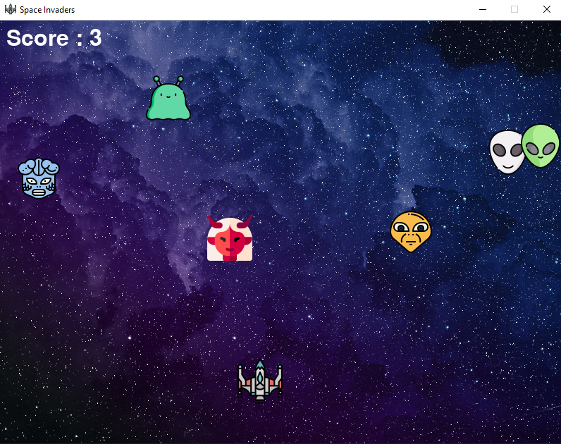
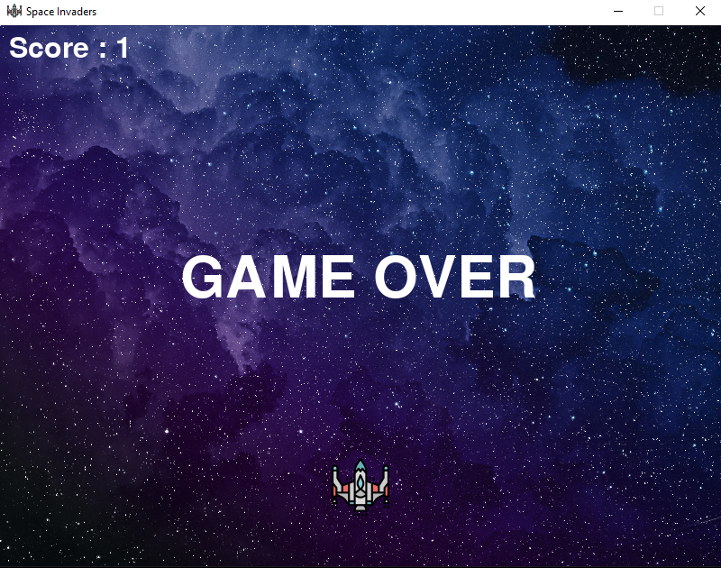
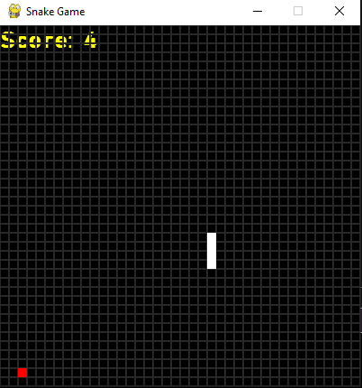
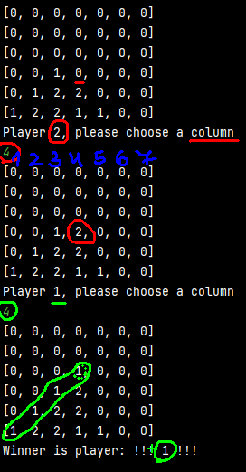

<<<<<<<
Some games I made in the past thanks to those tutorials:  
SpaceInvader: https://www.youtube.com/watch?v=FfWpgLFMI7w&ab_channel=freeCodeCamp.org  
Snake: https://www.youtube.com/watch?v=bfRwxS5d0SI&t=21s&ab_channel=BroCode  
=======
SpaceInvader:  
Sound of collision,fire and a background music added.  
Collision accomplished with the distance formula:  
D = sqrt((x2-x1)**2 + (y2-y1)**2)  
Game Over! when an enemy hits the ship  

Snake:  
There is snake speed up functionality.  

Connect4:  

